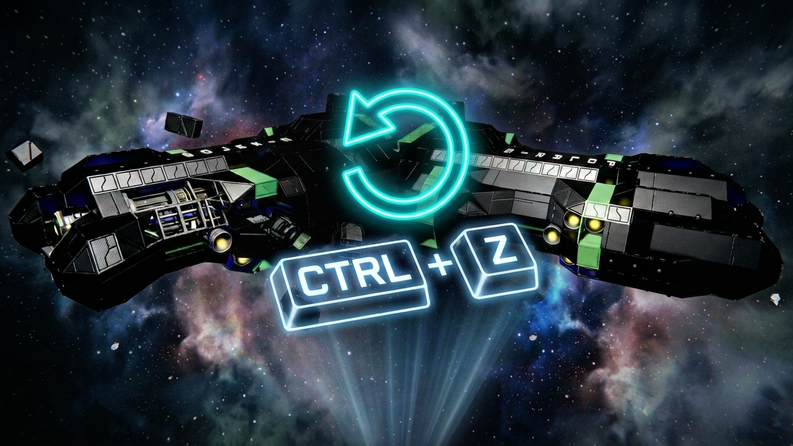
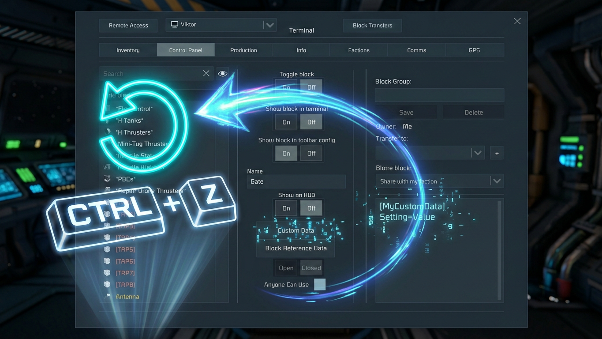
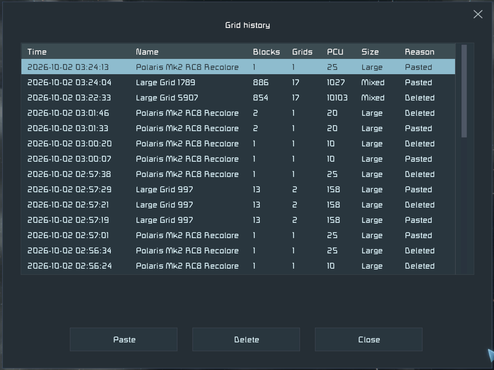

# Undo

Space Engineers 1 client plugin for [Pulsar](https://github.com/SpaceGT/Pulsar).

Video: [undo after editing a ship](https://youtu.be/fS_KpBiItiU)

Video: [undo and redo of terminal changes](https://youtu.be/xcvybKVaNjA)

Ctrl-Z reverts the latest operation in the current context, Ctrl-Y applies it again.
Covered: placing and removing blocks, painting and skins, pasting and deleting grids,
terminal property changes, block and grid names, Custom Data, block toolbars, programmable
block programs and single line text fields. The history is saved with the world and follows its backups.

Grids the plugin captures for undo (deleted, pasted, split) are kept under a size budget
and listed in a grid history dialog, sortable by time, name, block count and more. Double
click puts a backed up grid group on the clipboard for pasting. Ctrl-H opens it in
gameplay.

Vanilla binds Ctrl-Z to relative dampeners and Ctrl-Y to toggling all reactors. While
this plugin is enabled those move to Ctrl-Shift-Z and Ctrl-Shift-Y. In gameplay Ctrl-Z
is still relative dampeners while there is nothing to undo. All four bindings,
the history limits and the storage locations are in the plugin settings.

In survival, undo and redo only do what you could do by hand: place blocks as
construction sites from your inventory, paint, change terminal settings, names and
programs. Removing blocks, restoring them complete, pasting and deleting grids need
creative tools. On a dedicated server the plugin works client side only; a block or
grid it restores there gets new ids, so toolbar slots and groups that pointed at it
from outside have to be set again.

Design: [Docs/DESIGN.md](Docs/DESIGN.md). It records what the plugin hooks, how undo is
replayed through the game's own requests so multiplayer stays in sync, and what is
allowed in survival.

## Development

Based on the [client plugin template](https://github.com/CometWorks/client-plugin-template).
Run `setup.py` once to detect the game folder, then build the solution. Each build deploys
into Pulsar's `Local` plugin folder, see the template's README for the details.

Tests: `dotnet test UndoTests` runs the history, storage and grid store unit tests
without the game. The in game suites under `tests/` run on an isolated headless
client, offline and joined to a dedicated server, see [Docs/TESTING.md](Docs/TESTING.md).
